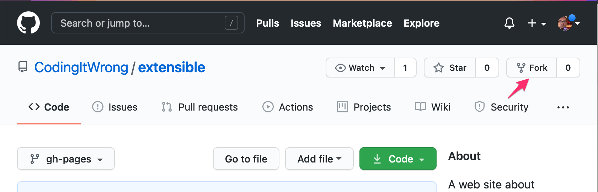
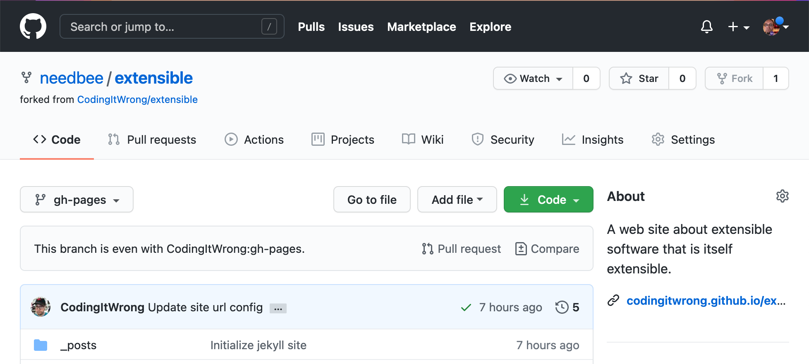
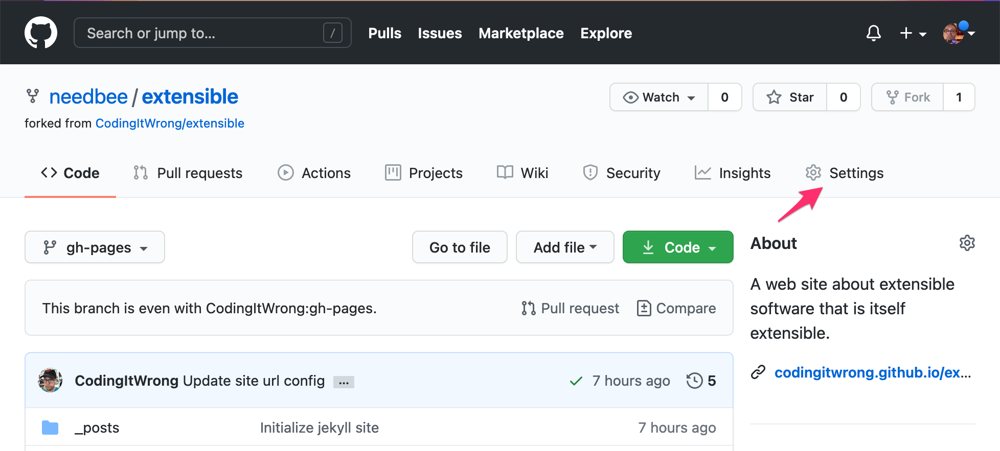
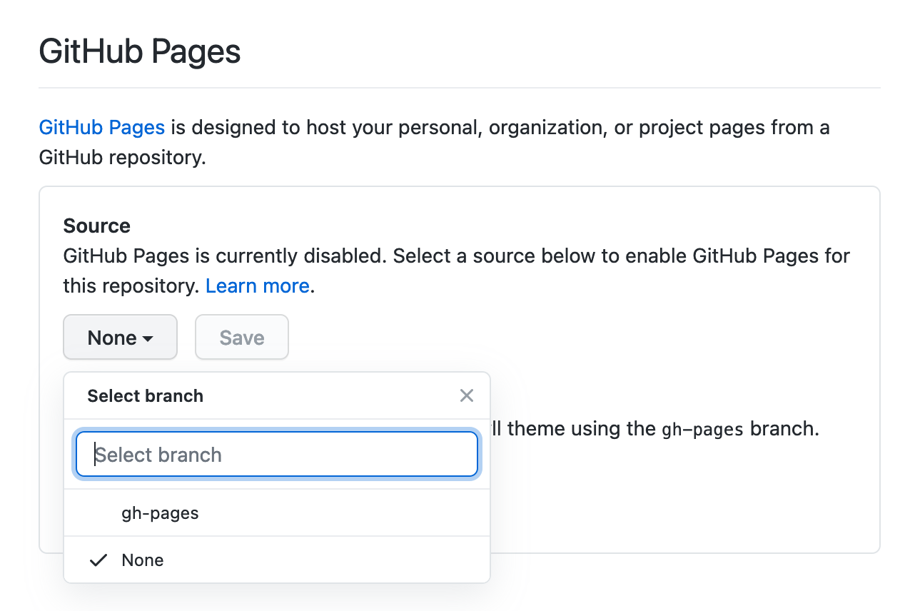
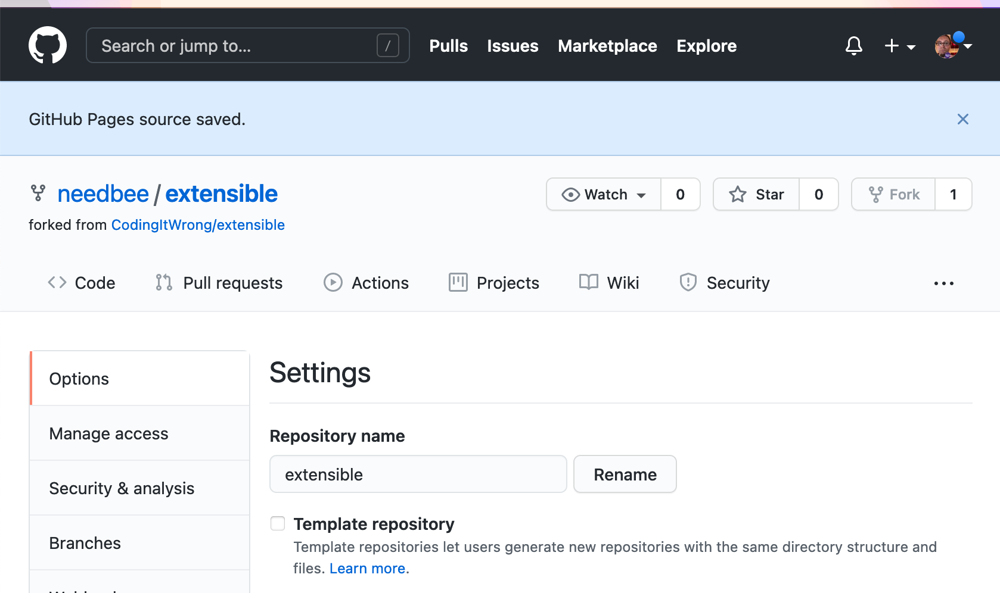
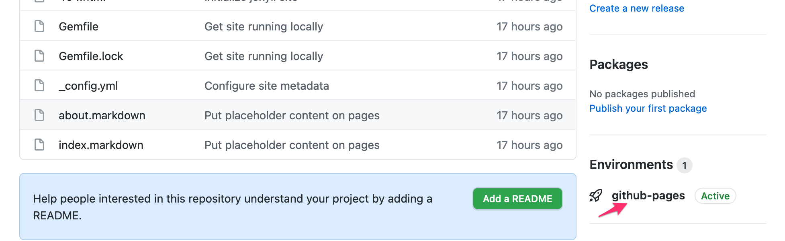
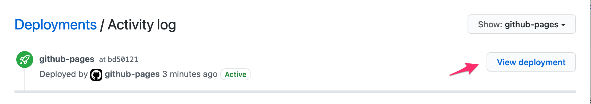

If you'd like your own web site, you can make a copy of this one! You don't need any special software or web server, just a free GitHub account.

* Go to the GitHub repository page for this web site.
* Click the "Fork" button to create a "fork", a copy of the repository that you own.

* If you aren't already logged in to GitHub, you'll be prompted to sign in or create a free account.
* After you're signed in to a GitHub account, you'll see a progress indicator for a few seconds as the repo is copied, then you'll be taken to the new repo under your GitHub username.

* GitHub Pages is not automatically activated for your forked repo, so let's turn it on. Click the Settings link.

* Scroll down to the "GitHub Pages" section. Under "Source", click the dropdown that says "None" and select `gh-pages`. Then click Save.

* The page will reload with a blue message that "GitHub Pages source saved."

* Click "Code" to go back to the main screen. In the right column, you should see an "Environments" section with "github-pages". If not, wait a few seconds then reload the page. When you see it, click "github-pages"

* You will see an "Activity log" listing deployments with one entry for "github-pages", showing that it is deployed. Click the "View deployment" button.

* A new browser tab will open with your new web site!
* Go back to the previous browser tab on GitHub and click the "Code" tab.
* You can now make any changes you like within your repo. You may want to start by editing `_config.yml`. It contains the basic info about the site, like site title and contact info.
* You can also edit and create new Markdown files to change the content of your site. Visit the [Jekyll web site](https://jekyllrb.com/) for more information on how to do different things in Jekyll.

When you find you want to make more changes, see [Customizing Your Copy of The Site](../customizing).
