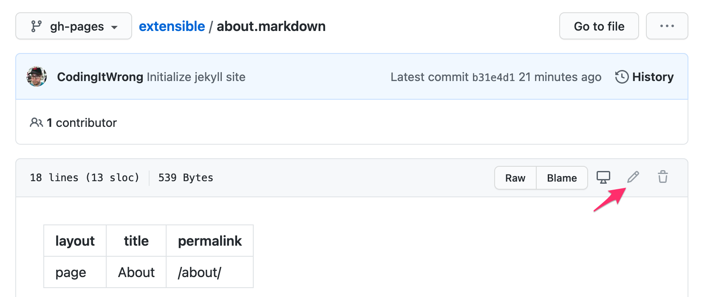
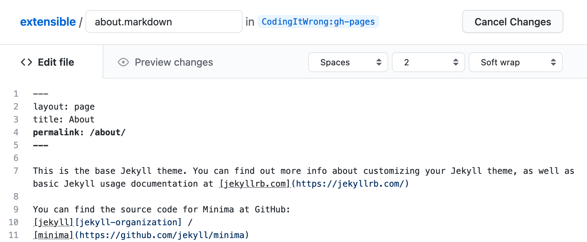
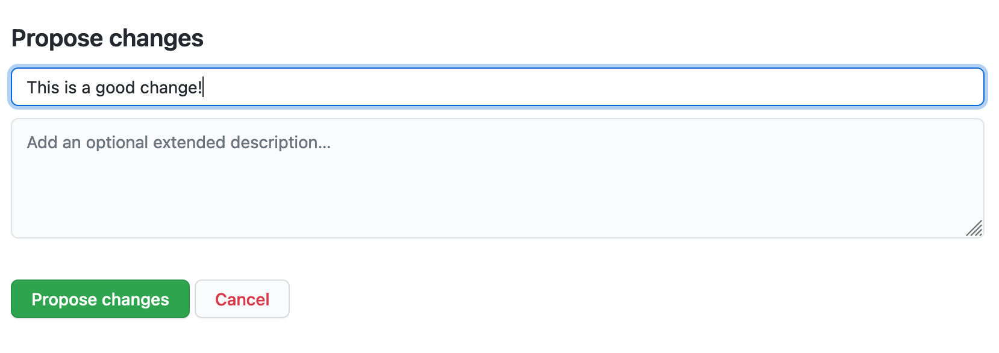
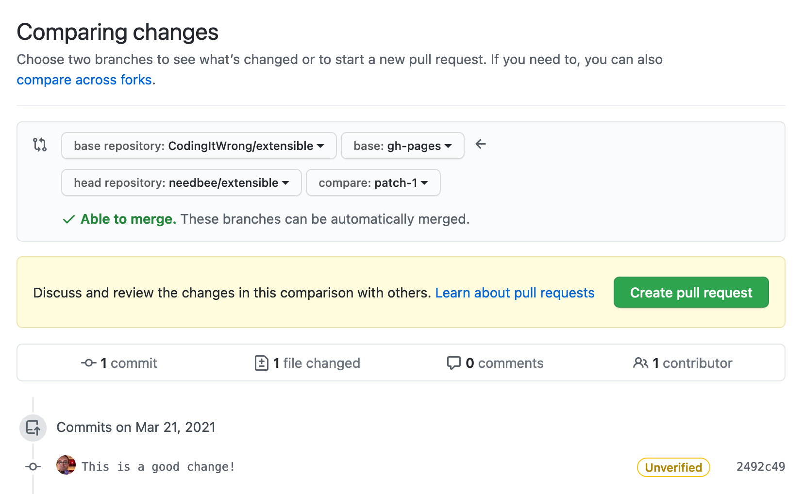
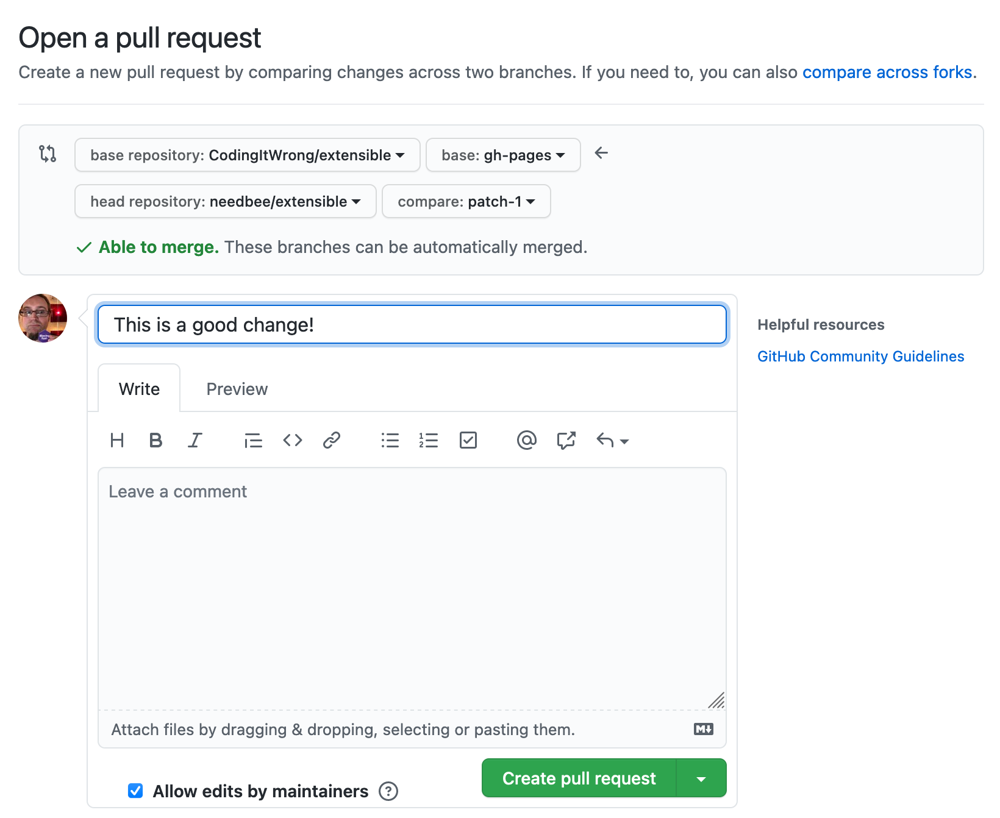
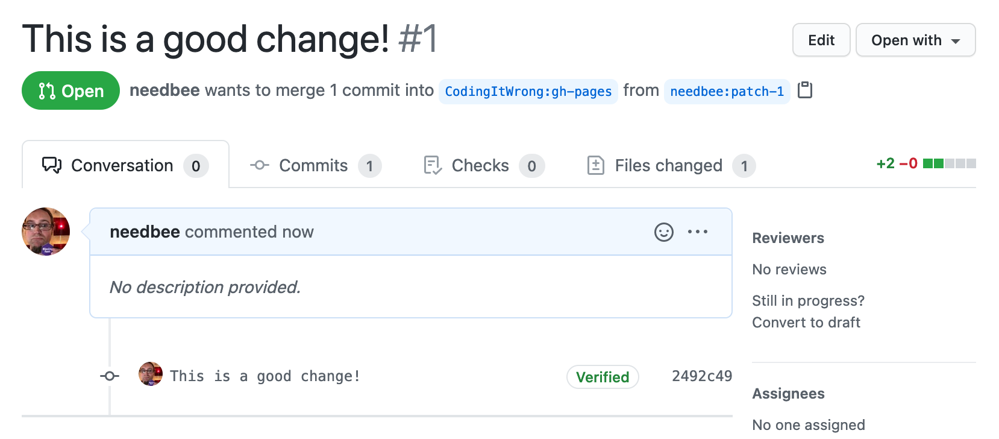

If you see a mistake on this site or would like to suggest some new content, you can!

This site is stored in GitHub, a version control system. It will allow you to propose a change, then the owner of this site will review it, potentially discuss the changes with you, and then accept them into the site.

* At the bottom of any page, click the Edit This Page link
* This will take you to the "source code" of the page on GitHub. From there, click the pencil icon. If you aren't logged in to GitHub, you'll be prompted to log in or create a free account.

* You'll be given a text editor with the source code of the page. It's written in a format called Markdown, which mostly reads like plain text with some special characters. To learn more, see [Mastering Markdown](https://guides.github.com/features/mastering-markdown/).

* Make any edits to the page you like, then scroll down to "Propose changes" and type in a one-sentence description of your change.

* Click the green "Propose changes" button. You'll be taken to a "Comparing changes" page that will show you what you changed. Click "Create pull request"

* You'll be taken to an "Open pull request" page. Add detail in the "Leave a comment" box if it helps explain the change, then click "Create pull request"

* You'll be taken to the page for your new pull request that is now open—you're all done.

* The owner of this site will review your proposal. They make have questions or feedback for you, in which case you'll receive an email notification. If they decide they want to incorporate your change, you'll see the site updated with your change.

If your change isn't accepted or if you want to make your own copy of the site that you can fully control, you can try [Making A Copy of The Site For Yourself](../making-a-copy).
